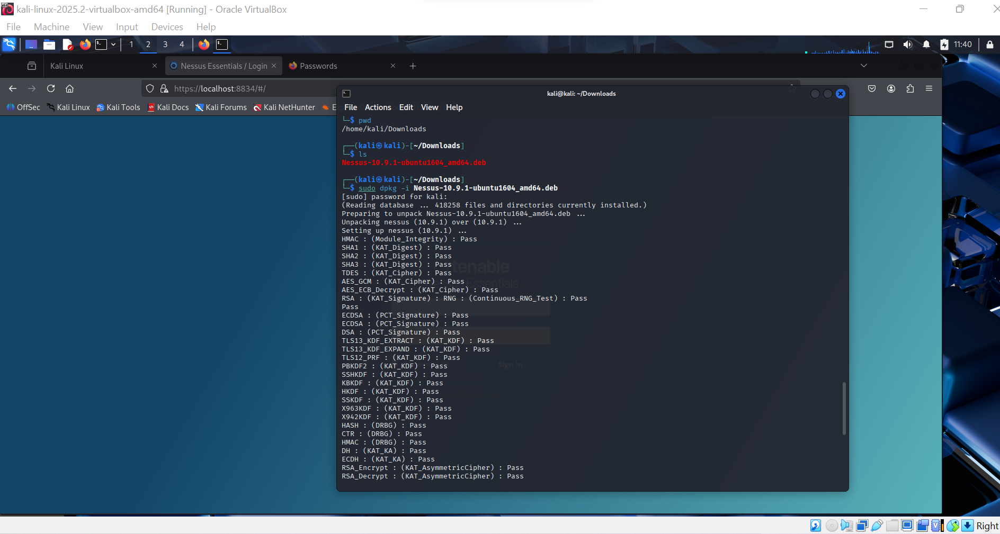
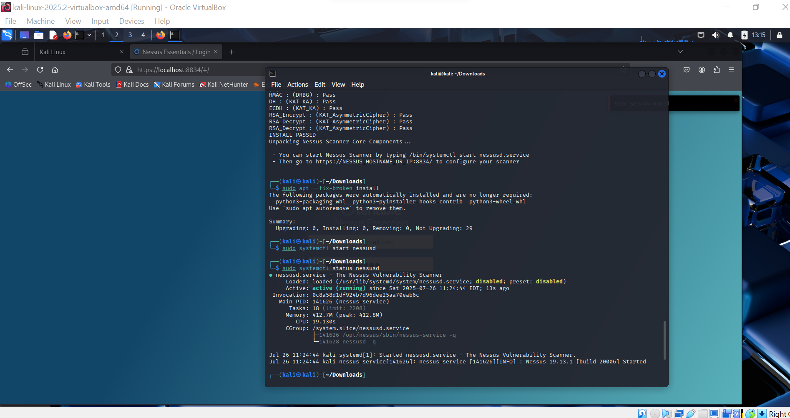
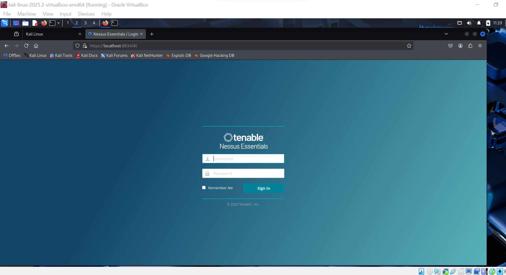

# Nessus-Kali-Scanner
A structured, beginner‑friendly document to install and use Nessus on Kali Linux for vulnerability scanning.

### Table of contents

- [Introduction](fr
- [Objective](#Objective)
- [Tools](#Tools)
- [Installation](#Installation)
- [Confirmation](#Confirmation)
- Conclusion

## Introduction
**Nessus** by **Tenable** is a top-tier **vulnerability scanner** that detects CVEs, missing patches, and misconfigurations across systems and networks. Kali Linux makes an ideal host for it in penetration testing labs and cybersecurity learning environments.

## Objective
Provide a clear, reproducible procedure to **download, install, activate, and use Nessus on Kali Linux**, run your first vulnerability scan, and view tools for reporting and troubleshooting

## Tools
- Operating System : ***Kali Linux***
- Browser : ***Firefox***
- Software : ***Nessus from Tenable***
- Privileges : ***Sudo/root***

## Installation
Download `.deb` from Tenable on firefox selecting Linux OS >>
```bash
sudo dpkg -i Nessus-10*.deb
```


## Configuration
Start up Nessus and enable
```bash
sudo systemctl start nessusd
sudo systemctl enable nessusd
```


## Confirmation
Visit `https://localhost:8834` → register/sign in **Nessus Essentials**

![Dashboard]
